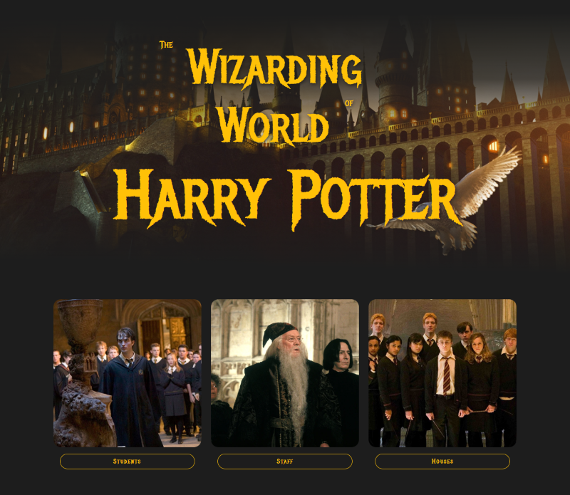
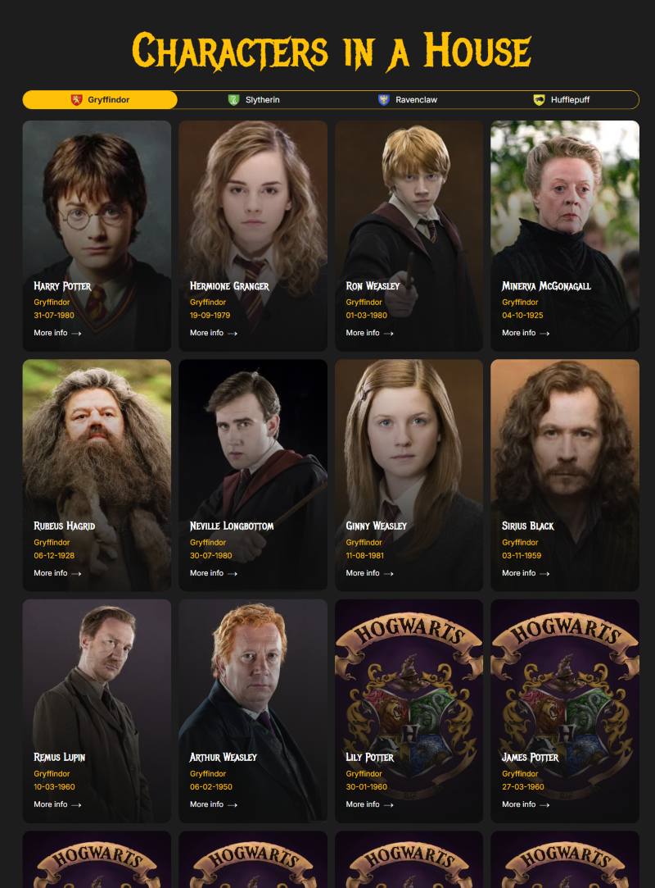
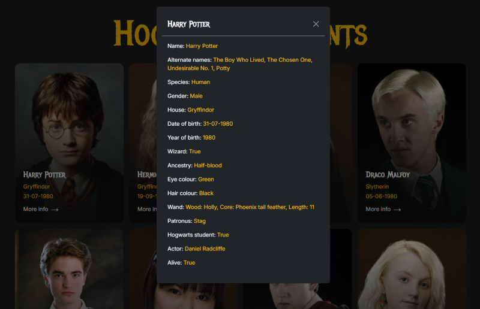

# ⚡ The Wizarding World of Harry Potter

A project built to demonstrate working with **Bootstrap** and **public APIs**.  
The project displays characters from the **Harry Potter** universe, divided into categories.

---

## 🧙‍♂️ Project Overview

The main page contains three sections:

- **Students**
- **Teachers**
- **Houses**

Each section includes a button that navigates to a separate page displaying the corresponding characters.  
All character data is fetched from a **public Harry Potter API** available online.

---

## ✨ Features

- Display characters as **cards** with basic information.
- **“More Info”** button opens a **modal window** with detailed character data.
- **Filtering** characters by Hogwarts houses on the house-specific page.
- Fully **responsive design** using Bootstrap grid and components.

---

## Deployment

This pet project deployed on **Vercel**.

[View on Vercel](https://harry-potter-olud.vercel.app/)

## Screenshots

Preview

Page

Modal

## 🧩 Technologies Used

- **HTML5**
- **CSS3 / Bootstrap 5**
- **JavaScript (ES6+)**
- **Fetch API**
- **Harry Potter API**

---

## 🚀 Purpose of the Project

This project was created to practice:

- Using **Bootstrap components** (cards, modals, buttons, grid system);
- Fetching and rendering data from a public API;
- Implementing **filtering** and **UI interactivity** with JavaScript;
- Building a **responsive web interface**.
